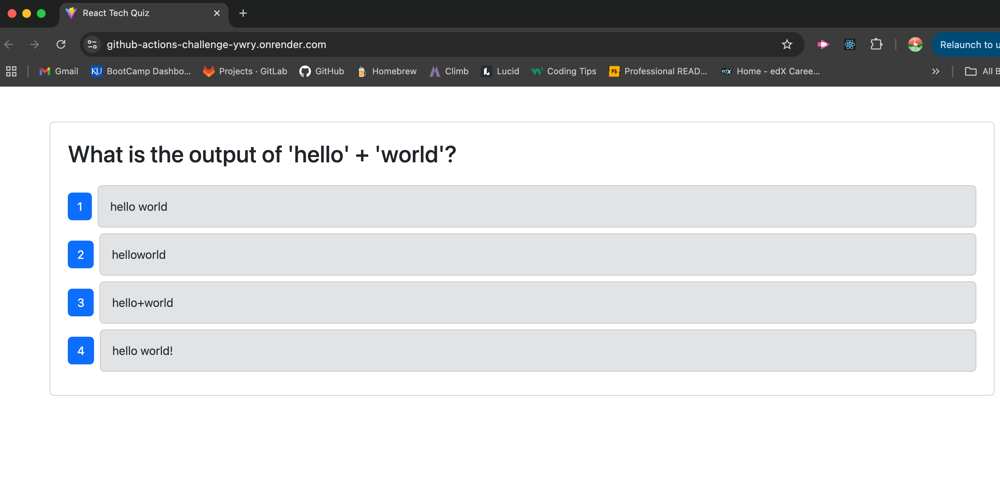

# Book Search Engine Challenge

## Table of Contents

 * [Description](#description)
 * [Installation](#installation)
 * [Usage Information](#usage-information)
 * [Contribution Guidelines](#contribution-guidelines)
 * [Credits](#credits)
 * [License](#license)
 * [Questions](#questions)

## Description
In this project I was given a full stack application for a quiz about Python that included Cypress testing. The challenge was to create Github Actions that ran when feature branches were pushed up to the develop branch and when the develop branch was pushed up to the main branch. I was also tasked to set up an action to deploy the application on Render everytime the main branch was updated. This project was a great way to get more familiar with Github actions and their usefulness to run tests and deploy a polished product.

## Live URL

[Link to Deployed Site](https://github-actions-challenge-ywry.onrender.com/)

()

## Installation
1. Clone the repo onto your machine using the command "git clone" using the SSH key from the repository.
2. Open respository in VS code (download this if necessary). 
3. Install necessary packages by running "npm install". 
4. Build application by running "npm run build" and "npm run seed".
5. Run "npm run develop" to get the server running and see the application working in the browser.

## Usage Information
Once server is running, the Apollo Sandbox can be used to test routes for getting, updating, posting, and deleting data on the search engine.

## Contribution Guidelines
I am open to collaborations. Any changes should made on a feature branch and pull requests will need to be reviewed before being added to the main branch.

## Credits
My tutor Alexis assisted in working out some errors I was getting when trying to seed the data and getting the application to fully function when deployed. The Xpert Learning Assistant on BootCampSpot was able to suggest solutions for other issues in the application.

## License
This application is covered under the [MIT License](https://opensource.org/licenses/MIT).

## Questions?
Follow the link below to see my Github account and additional respositories. Click on my email address to send me a message if you have any questions!

[Link to Github](http://github.com/dlwortmann)

<a href="mailto:dannywortmann@gmail.com">dannywortmann@gmail.com</a>

